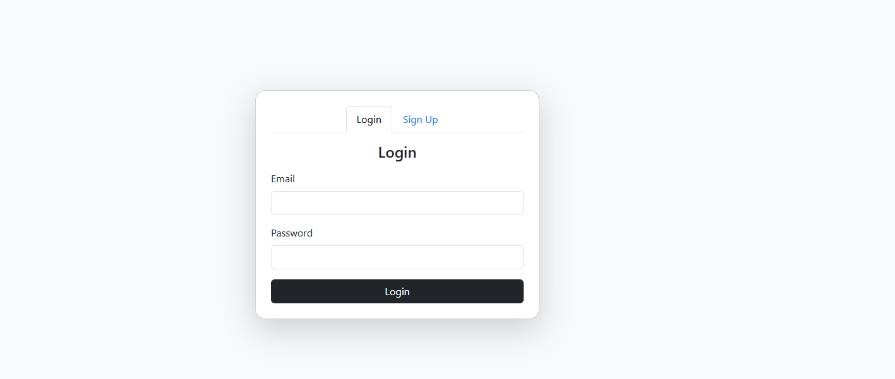

# 🔐 Login & Signup Page (HTML, CSS, JavaScript)

A **responsive login and signup page** built using **HTML, CSS, and JavaScript**.  
It includes form validation, modern UI design, and smooth transitions between login & signup modes.

---

## ✨ Features
- 🔑 **Login & Signup forms** in one page  
- 📱 **Responsive design** (desktop & mobile)  
- ✅ **Form validation** with JavaScript  
- 🎨 **Modern UI with hover effects**  
- 🔄 Smooth transitions between **login ↔ signup**  

---

## 🧰 Tech Stack
- **HTML5** – structure  
- **CSS3** – styling & responsive layout  
- **JavaScript (ES6)** – form validation & interactions  
- **Bootstrap 5** – responsive layout & components 

---

 

 

 

---
